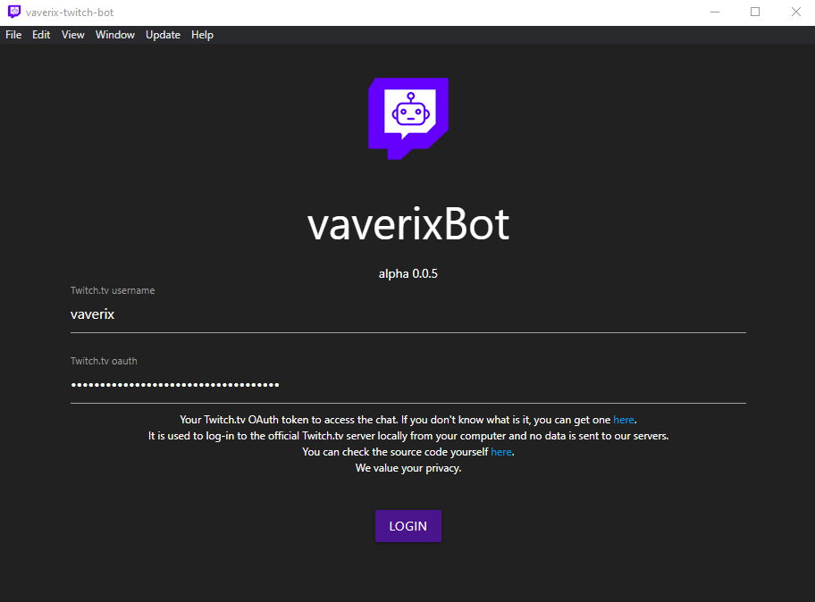
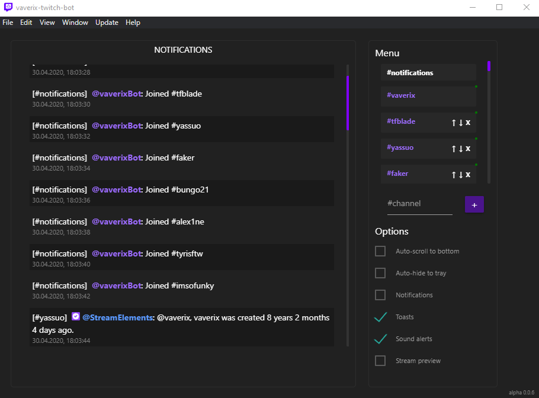
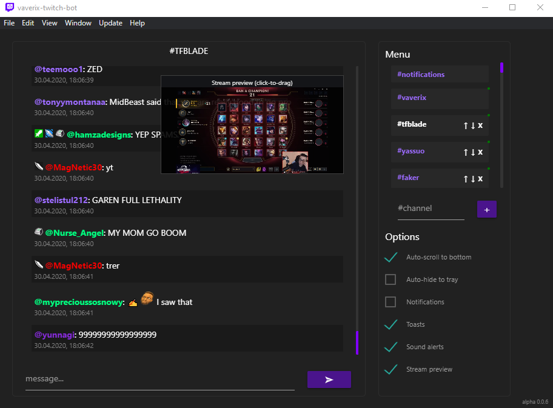
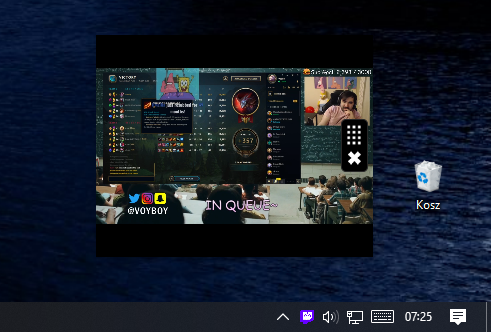
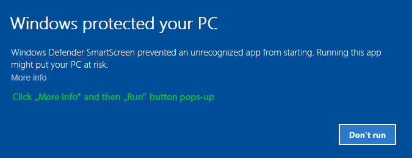

# vaverix-twitch-bot

Desktop application that allows you to log-in into multiple Twitch.tv channels at once. It also notifies you when someone mentions you in any channel you choose and has couple of other extra features.
It is more lightweight for your PC's CPU and memory comparing to web browser with many Twitch.tv tabs opened, and it can be left running in the background.

Doesn't matter if you wanna grind channel points or just be aware if someone is talking about you, this app is for you!









## Getting Started

### Installation

Just head to [releases](https://github.com/vaverix/vaverix-twitch-bot/releases) page, download the latest .exe file and run it! That's it.

### Is this app safe

Yes. It uses an oAuth token to log-in as you and it doesn't send anything anywhere besides official Twitch.tv server. You can even check the source code and compile the app yourself!

### What is an oAuth token and why can't I just log-in with my password

It's just much safer. oAuth token is used to authorize you as you and it gives limited access to your account. This way, 3rd party applications can't discover your password and it prevents your accounts from being stolen in several ways. More information [here](https://en.wikipedia.org/wiki/OAuth).

### Ok, where can I get an oAuth token

You can generate your token using Twitch API. But if you are not a computer programmer, you can get one [here](https://twitchapps.com/tmi/). It generates your token locally in your browser, shows it to you only and it doesn't send it anywhere else.

### Windows SmartScreen

If Windows Defender SmartScreen blocks the app from running, you can just click "More info" and then click "Run". Don't worry, it's perfectly safe, it pops-up because I don't sign the installer with Microsoft certificate.



### Changelog

You can find always up-to-date changelog [here](https://github.com/vaverix/vaverix-twitch-bot/blob/master/CHANGELOG.md).

### Compiling the app yourself

The use of the [yarn](https://yarnpkg.com/) package manager is **strongly** recommended, as opposed to using `npm`.
Make sure to check out [`electron-webpack`'s documentation](https://webpack.electron.build/) for more details.

```bash
git clone https://github.com/vaverix/vaverix-twitch-bot.git
cd vaverix-twitch-bot
rm -rf .git

# install dependencies
yarn
```

### Development Scripts

```bash
# run application in development mode
yarn dev

# compile source code and create webpack output
yarn compile

# `yarn compile` & create build with electron-builder
yarn dist

# `yarn compile` & create unpacked build with electron-builder
yarn dist:dir
```
